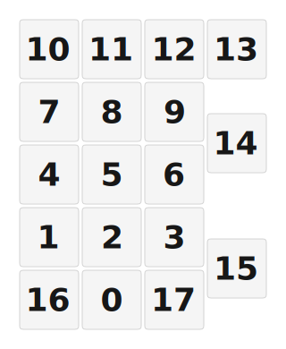

# ZMK Configuration for Jaime's Numpad

*Generated by Shield Wizard for ZMK*



Download compiled firmware from the Actions tab. <https://zmk.dev/docs/user-setup#installing-the-firmware>

Edit your keymap <https://zmk.dev/docs/keymaps>.
User keymap is located at [`config/jaime_s_numpad.keymap`](config/jaime_s_numpad.keymap).

-----

<details>
<summary>
Shield Wizard Debug Information
</summary>

In case of broken configuration, here is the Shield Wizard internal data used to generate this configuration:

Commit: 5840d41ac0915092c8fe45da617ffb4bb91e1b97

```json
{"name":"Jaime's Numpad","shield":"jaime_s_numpad","dongle":false,"modules":[],"layout":[{"id":"01KM20JF42NG35BD4WYMJ9FYAB","part":0,"row":0,"col":0,"w":1,"h":1,"x":1,"y":4,"r":0,"rx":0,"ry":0},{"id":"01KM20JJB6J3W68AZC2RWGEZV2","part":0,"row":0,"col":1,"w":1,"h":1,"x":0,"y":3,"r":0,"rx":0,"ry":0},{"id":"01KM20JJSJR346C88VK0F5VNK2","part":0,"row":0,"col":2,"w":1,"h":1,"x":1,"y":3,"r":0,"rx":0,"ry":0},{"id":"01KM20JPHWVG8YRY8VTT8G8H1P","part":0,"row":0,"col":3,"w":1,"h":1,"x":2,"y":3,"r":0,"rx":0,"ry":0},{"id":"01KM20MH5V6VBK798480AZ9J6D","part":0,"row":0,"col":4,"w":1,"h":1,"x":0,"y":2,"r":0,"rx":0,"ry":0},{"id":"01KM20NAYH0HVHKX5XM7WHEK9P","part":0,"row":0,"col":5,"w":1,"h":1,"x":1,"y":2,"r":0,"rx":0,"ry":0},{"id":"01KM20NTDFP9KW0HYTEQHBYKXB","part":0,"row":0,"col":6,"w":1,"h":1,"x":2,"y":2,"r":0,"rx":0,"ry":0},{"id":"01KM20P040NZ8SVD5M9DZM4FFQ","part":0,"row":0,"col":7,"w":1,"h":1,"x":0,"y":1,"r":0,"rx":0,"ry":0},{"id":"01KM20P0B76J4XYBTSQ5KNYS2Z","part":0,"row":0,"col":8,"w":1,"h":1,"x":1,"y":1,"r":0,"rx":0,"ry":0},{"id":"01KM20P0SH6X56GP4DTJ2CHT1V","part":0,"row":0,"col":9,"w":1,"h":1,"x":2,"y":1,"r":0,"rx":0,"ry":0},{"id":"01KM20PM3JSQP0PEY31SH43G1D","part":0,"row":0,"col":10,"w":1,"h":1,"x":0,"y":0,"r":0,"rx":0,"ry":0},{"id":"01KM20PT3A83MJYF7R3C9TH1GR","part":0,"row":0,"col":11,"w":1,"h":1,"x":1,"y":0,"r":0,"rx":0,"ry":0},{"id":"01KM20PTG3YBDPNKFG9J9WP4EA","part":0,"row":0,"col":12,"w":1,"h":1,"x":2,"y":0,"r":0,"rx":0,"ry":0},{"id":"01KM20Q6Q7HCEWPBKSKZ0F0XR3","part":0,"row":0,"col":13,"w":1,"h":1,"x":3,"y":0,"r":0,"rx":0,"ry":0},{"id":"01KM20QCA8EQXR0J8BW6XK9KA8","part":0,"row":0,"col":14,"w":1,"h":1,"x":3,"y":1.5,"r":0,"rx":0,"ry":0},{"id":"01KM20QR1D85KTACYCYEF4ENX2","part":0,"row":0,"col":15,"w":1,"h":1,"x":3,"y":3.5,"r":0,"rx":0,"ry":0},{"id":"01KM20QY399NJ2AD71QE1N2WS7","part":0,"row":0,"col":16,"w":1,"h":1,"x":0,"y":4,"r":0,"rx":0,"ry":0},{"id":"01KM20R6BE61MX831K1HMG2R6B","part":0,"row":0,"col":17,"w":1,"h":1,"x":2,"y":4,"r":0,"rx":0,"ry":0}],"parts":[{"name":"unibody","controller":"nice_nano_v2","wiring":"matrix_diode","pins":{"d1":"input","d0":"input","d4":"input","d5":"input","d7":"input","d21":"output","d20":"output","d19":"output","d18":"output"},"keys":{"01KM20PM3JSQP0PEY31SH43G1D":{"input":"d1","output":"d21"},"01KM20PT3A83MJYF7R3C9TH1GR":{"input":"d1","output":"d20"},"01KM20PTG3YBDPNKFG9J9WP4EA":{"input":"d1","output":"d19"},"01KM20Q6Q7HCEWPBKSKZ0F0XR3":{"input":"d1","output":"d18"},"01KM20P040NZ8SVD5M9DZM4FFQ":{"input":"d0","output":"d21"},"01KM20P0B76J4XYBTSQ5KNYS2Z":{"input":"d0","output":"d20"},"01KM20P0SH6X56GP4DTJ2CHT1V":{"input":"d0","output":"d19"},"01KM20MH5V6VBK798480AZ9J6D":{"input":"d4","output":"d21"},"01KM20NAYH0HVHKX5XM7WHEK9P":{"input":"d4","output":"d20"},"01KM20NTDFP9KW0HYTEQHBYKXB":{"input":"d4","output":"d19"},"01KM20QCA8EQXR0J8BW6XK9KA8":{"input":"d4","output":"d18"},"01KM20JJB6J3W68AZC2RWGEZV2":{"input":"d5","output":"d21"},"01KM20JJSJR346C88VK0F5VNK2":{"input":"d5","output":"d20"},"01KM20JPHWVG8YRY8VTT8G8H1P":{"input":"d5","output":"d19"},"01KM20QY399NJ2AD71QE1N2WS7":{"input":"d7","output":"d21"},"01KM20JF42NG35BD4WYMJ9FYAB":{"input":"d7","output":"d20"},"01KM20R6BE61MX831K1HMG2R6B":{"input":"d7","output":"d19"},"01KM20QR1D85KTACYCYEF4ENX2":{"input":"d7","output":"d18"}},"encoders":[],"buses":[{"name":"spi0","devices":[],"type":"spi"},{"name":"spi1","devices":[],"type":"spi"},{"name":"spi2","devices":[],"type":"spi"},{"name":"spi3","devices":[],"type":"spi"},{"name":"i2c0","devices":[],"type":"i2c"},{"name":"i2c1","devices":[],"type":"i2c"}]}]}
```

</details>
